  

  
  

 
<table align="center">
  <tr>
    <td align="center" width="50%">
      <h3>🚀 Backend & Software</h3>
      
    </td>
    <td align="center" width="50%">
      <h3>☁️ Infrastructure & DevOps</h3>
      
    </td>
  </tr>
</table>
 

  

